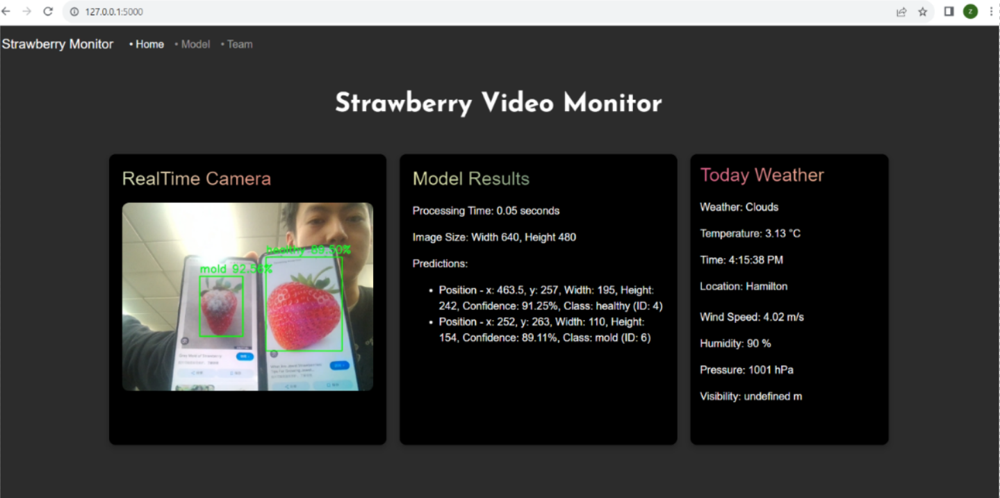
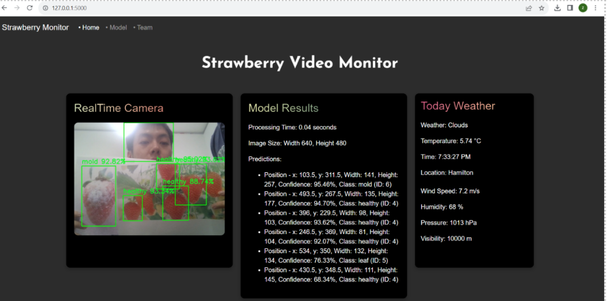
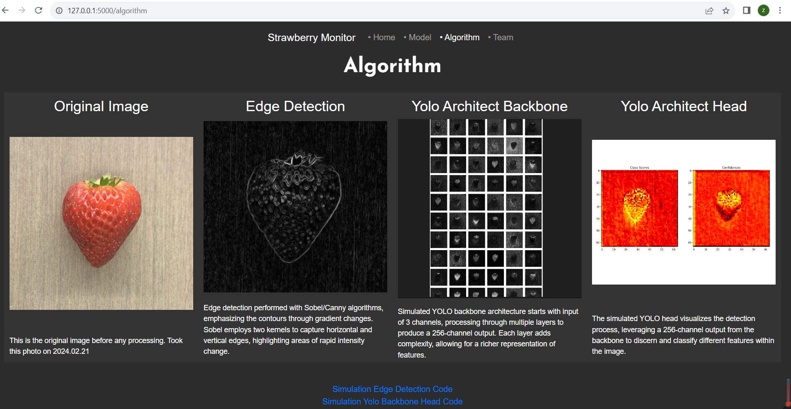
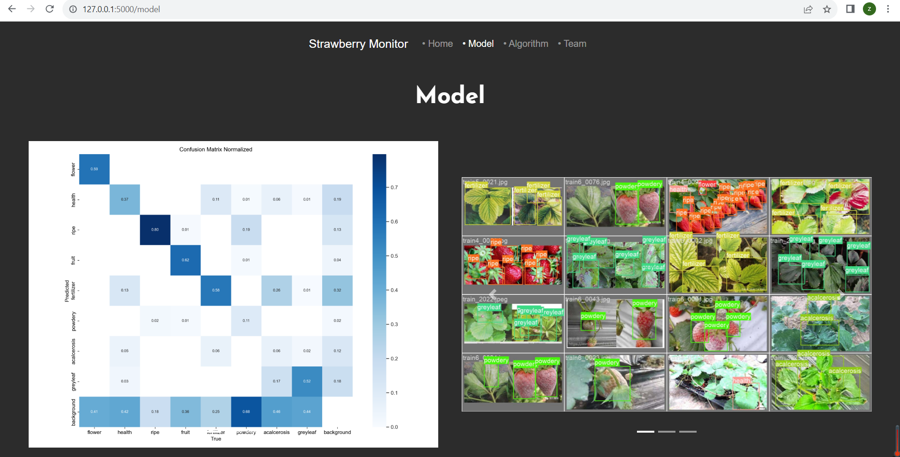
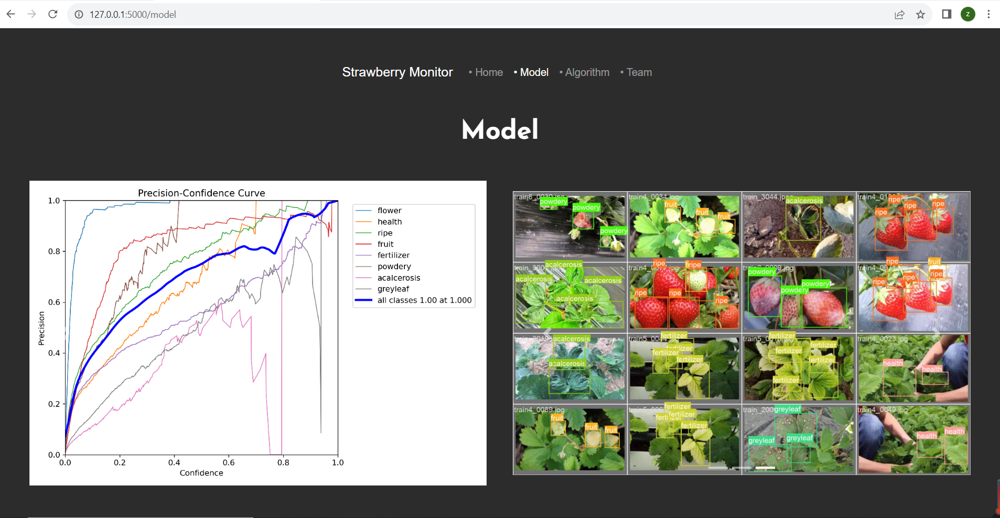

# AI-Driven Agricultural Monitoring System

### Description:

This project leverages computer vision and deep learning technologies to develop a comprehensive real-time monitoring and health assessment system for strawberries. Using a YOLOv8 model, the system not only detects strawberries but also classifies their health status to automate irrigation and pesticide application, ensuring optimal agricultural management through a sophisticated web interface. 
项目利用计算机视觉 CV 和深度学习 DL 技术，开发了一个全面的草莓实时监控和健康评估系统。通过使用YOLOv8模型，该系统不仅能检测草莓，还能对其健康状况进行分类，自动化灌溉和施药，通过网络界面确保最优的农业管理。

### Monitoring Interface:

Differentiate between healthy / moldy strawberry; 
Implemented a high-performance real-time video processing system for strawberry detection; 
Utilizes advanced image processing techniques with OpenCV and Python to detect strawberries in live video feeds; 
Optimized video stream bandwidth through advanced data compression techniques; 
Developed a responsive front-end interface, integrating WebSocket communication to ensure seamless real-time data transfer between the backend and frontend, facilitating immediate updates and interactive user engagement; 
区分出不同的草莓:健康和发霉的草莓; 在图中有不同的标签  
实现了一个用于草莓检测的高性能实时视频处理系统；利用 OpenCV 和 Python 的图像处理技术在实时视频流中检测草莓； 
通过数据压缩技术优化了视频流带宽； 
开发了一个响应式前端界面，整合了 WebSocket 通信，以确保后端与前端之间的无缝实时数据传输，便于实时更新和增强用户互动。

Real-Time data (JSON format) return to user monitoring screen; 
Features multiple API endpoints managed via Flask to handle real-time data transactions and system commands; 
Offers a dynamic and user-friendly front-end, built with React.js, which provides real-time data visualization and interaction through WebSocket communication; 

实时数据（JSON格式）返回至用户监控屏幕； 
通过 Flask 管理多个 API 端点，以处理实时数据交易和系统命令； 
提供一个动态且用户友好的前端界面，使用 React.js 构建，通过 WebSocket 通信实现实时数据可视化和交互

### Model Algorithm Page:

Leveraged a YOLOv8 deep learning model to differentiate between healthy / moldy strawberry; 
利用 YOLOv8 深度学习模型区分健康和霉变的草莓；

### Model Training Shown:

Training on a dataset of 3225 annotated images to ensure high precision and recall across multiple classes; 
Deploys the trained model for real-time and batch inference, enhancing the capability of monitoring systems to detect and react to health issues immediately 
在包含 3225 张标注图像的数据集上进行训练，以确保多个类别中的高精度和高召回率； 
部署训练好的模型进行实时和批量推理，增强监控系统检测和立即响应健康问题的能力。

The system automatically initiates real-time irrigation based on health detection via COM serial communication to Arduino; 
Integrates COM serial communication to automate irrigation and pesticide spraying based on the detected health condition of the strawberries, significantly improving response times and effectiveness of treatment. 

系统通过 COM 串行通信自动触发基于健康检测的实时灌溉； 
集成 COM 串行通信，根据检测到的草莓健康状况自动化灌溉和喷洒农药，显著提高响应时间和治疗效果。

### Project Impact:

This system transforms traditional strawberry farming by integrating artificial intelligence with agricultural practices, leading to increased efficiency, reduced waste, and improved crop health through timely interventions. It stands as a testament to the potential of AI in revolutionizing farming and sustainability practices. 
该系统通过将人工智能与农业实践相结合，改变了传统的草莓种植方式，带来了效率的提升、浪费的减少以及通过及时干预改善的作物健康。这证明了人工智能在革新农业和可持续实践方面的潜力。
